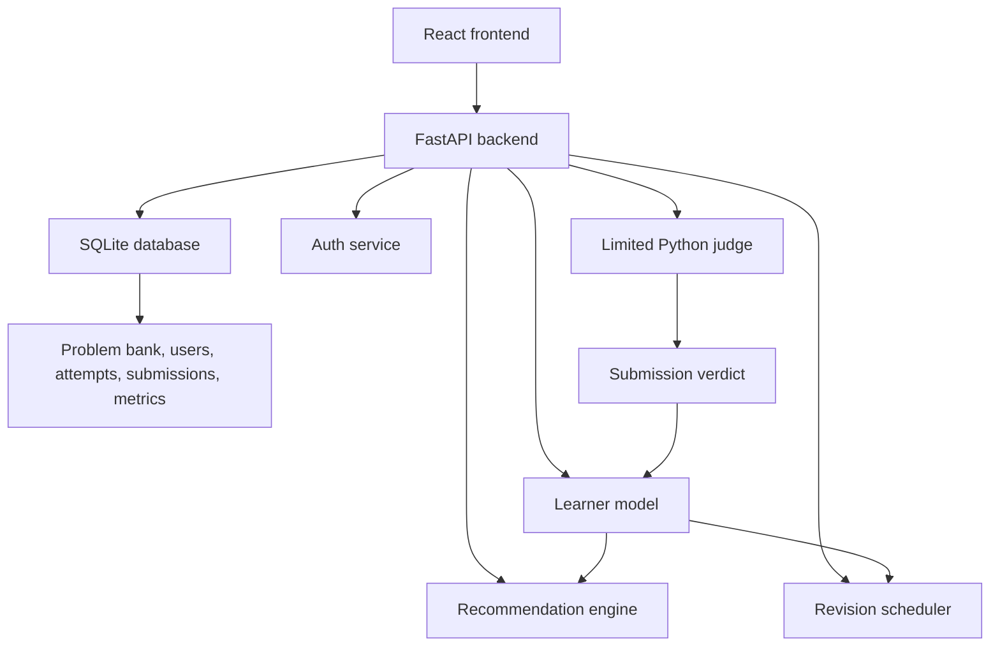

# Intelligent Learning Assistant for Coding based on ITS

Capstone project for an Intelligent Tutoring System (ITS) based coding practice platform.

**Student:** Anshu Sinha (2034EBCS191)  
**Advisor:** Vamsi Bandi  
**Current version:** Capstone build after Phase 1, Phase 2, and Phase 3

## Overview

This project is a web-based coding practice and analytics system. It combines a curated DSA problem bank, authentication, a LeetCode-style practice UI, a limited Python judge, learner modeling, adaptive recommendations, spaced revision scheduling, and a dashboard for progress insights.

The key idea is not only to let a learner solve problems, but to track attempts, identify weak topics and patterns, recommend unseen problems, and schedule revision using ITS principles.

## Current Features

- User registration and login using JWT authentication.
- Curated DSA problem bank with 630 problems loaded from `data/dsa_problems.md`.
- React/Vite frontend based on an online IDE style UI.
- Problem list, problem detail page, split-pane code editor, and submission flow.
- Monaco editor for Python code.
- Limited Python judge for executable demo problems.
- Manual attempt recording support through backend API.
- Learner model that recomputes mastery and error frequency after attempts.
- Recommendation engine that scores unseen problems by weakness and difficulty.
- Spaced repetition scheduler for solved problems.
- Dashboard for solved count, success rate, streak, weaknesses, and due revisions.
- CSV export of user attempt history.

## Project Structure

```text
.
├── src/
│   ├── main.py                 # FastAPI routes and service wiring
│   ├── database.py             # SQLite schema and migration helpers
│   ├── models.py               # Pydantic request/response models
│   ├── auth.py                 # JWT auth and bcrypt password hashing
│   ├── learner_model.py        # Mastery, weakness, and error analytics
│   ├── recommender.py          # Personalized recommendation scoring
│   ├── revision_scheduler.py   # Spaced repetition scheduler
│   ├── judge.py                # Limited Python judge for demo submissions
│   └── config.py               # Environment-driven runtime config
├── frontend/
│   ├── src/                    # React/Vite frontend
│   ├── package.json            # Frontend dependencies and scripts
│   └── vite.config.js          # Frontend build config
├── data/
│   ├── dsa_problems.md         # Curated DSA problem bank
│   └── coding_assistant.db     # Local SQLite DB, generated/updated locally
├── load_sample_data.py         # Seeds problem bank and demo user
├── test_installation.py        # Backend smoke tests
├── requirements.txt            # Backend dependencies
└── run.sh                      # Backend convenience runner
```

## Architecture



## Learning Flow

1. User registers or logs in.
2. User opens the DSA problem bank.
3. User solves a problem in the editor or records an attempt.
4. Backend stores the attempt/submission.
5. Learner model recomputes topic and pattern mastery.
6. Recommender ranks unseen problems.
7. Revision scheduler creates review tasks for solved problems.
8. Dashboard shows progress, weak areas, recommendations, and due revisions.

## Tech Stack

**Backend**

- Python
- FastAPI
- SQLite
- Pydantic
- bcrypt
- JWT

**Frontend**

- React
- Vite
- Tailwind CSS
- shadcn-style UI components
- Monaco Editor
- React Router

**Data**

- Curated DSA markdown problem bank
- SQLite local storage

## Quick Start

### 1. Backend Setup

```bash
python3 -m pip install -r requirements.txt
python3 load_sample_data.py
PORT=8020 python3 -m src.main
```

Backend runs at:

```text
http://localhost:8020
```

API docs:

```text
http://localhost:8020/docs
```

### 2. Frontend Setup

```bash
cd frontend
npm install
npm run dev -- --host 0.0.0.0 --port 5173
```

Frontend runs at:

```text
http://localhost:5173
```

If needed, force API URL:

```text
http://localhost:5173/?api=http://localhost:8020/api
```

### 3. Demo Login

```text
Email: demo@example.com
Password: demo123
```

## Environment Variables

Backend:

- `SECRET_KEY` defaults to `dev-secret-change-me`
- `JWT_ALGORITHM` defaults to `HS256`
- `ACCESS_TOKEN_EXPIRE_MINUTES` defaults to `1440`
- `HOST` defaults to `0.0.0.0`
- `PORT` defaults to `8000`
- `CORS_ALLOW_ORIGINS` defaults to local frontend origins including `5173`

Frontend:

- Runtime `?api=http://localhost:PORT/api` overrides the backend API base URL and is stored in local storage.
- The default frontend API URL is `http://localhost:8020/api`.

## API Endpoints

Authentication:

- `POST /api/auth/register`
- `POST /api/auth/login`
- `GET /api/auth/me`

Problems:

- `GET /api/problems`
- `GET /api/problems/{problem_id}`
- `POST /api/problems` admin only

Practice and submissions:

- `POST /api/attempts`
- `GET /api/attempts`
- `POST /api/submissions`
- `GET /api/submissions`

Recommendations:

- `POST /api/recommendations/generate`
- `GET /api/recommendations`
- `POST /api/recommendations/{rec_id}/complete`

Analytics:

- `GET /api/analytics/dashboard`
- `GET /api/analytics/weaknesses`
- `GET /api/analytics/errors`
- `GET /api/analytics/export`

Revisions:

- `GET /api/revisions/due`
- `POST /api/revisions/{schedule_id}/complete`

## Problem Bank

Problems are loaded from:

```text
data/dsa_problems.md
```

The current markdown bank parses into 630 problems.

The loader parses markdown headings into:

- topic
- difficulty
- problem title
- source URL
- tags
- description

Some key problems also include executable sample tests for the limited judge, such as:

- `two-sum`
- `contains-duplicate`
- `valid-anagram`
- `valid-palindrome`
- `longest-substring`
- `climbing-stairs`

Run this after editing the markdown bank:

```bash
python3 load_sample_data.py
```

## Data Model

SQLite tables:

- `users`
- `problems`
- `attempts`
- `learner_metrics`
- `recommendations`
- `revision_schedule`
- `submissions`

## Limited Judge

`src/judge.py` provides a demo Python judge.

It supports:

- function-style Python submissions
- JSON test cases stored in the `problems` table
- subprocess timeout
- restricted import allowlist for common modules such as `typing`, `math`, `collections`, `heapq`, `bisect`, and `itertools`

Important: this judge is suitable for capstone demo only. A production judge must use stronger isolation such as Docker, Judge0, or a separate sandboxed runner service.

## Recommendation Logic

The recommender scores unseen problems using:

- topic weakness
- pattern weakness
- target difficulty match

It stores the top recommendations with human-readable explanations.

## Learner Model

The learner model tracks:

- total attempts
- solved problems
- topic mastery
- pattern mastery
- error frequency
- recurring error types
- current streak

Mastery is computed as accepted attempts divided by total attempts for each topic or pattern.

## Spaced Repetition

Solved problems are scheduled for revision using intervals:

```text
1, 3, 7, 14, 30, 60 days
```

After the final interval, the schedule continues with longer intervals capped at 90 days.

## Testing

Backend smoke test:

```bash
python3 test_installation.py
```

Compile check:

```bash
python3 -m compileall -q src load_sample_data.py test_installation.py
```

Frontend build:

```bash
cd frontend
npm run build
```

## Deployment Notes

Recommended capstone deployment:

- Frontend on Vercel.
- Backend on Render, Railway, Fly.io, or another Python-capable host.
- Database upgrade from SQLite to Postgres/Supabase before multi-user public deployment.
- Judge moved to a Dockerized runner service before allowing untrusted public code execution.
- GitHub Pages alone is suitable only for a static frontend; the authenticated backend, database, recommendations, and judge require a separate backend service.

## License

MIT License. See `LICENSE`.
