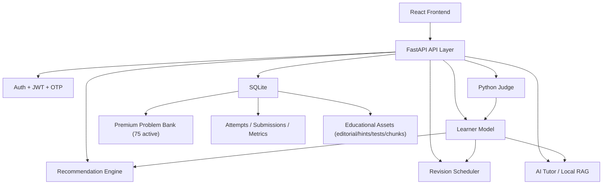

# Intelligent Learning Assistant for Coding based on ITS

Capstone project implementing an Intelligent Tutoring System (ITS) for coding practice.

**Student:** Anshu Sinha (2034EBCS191)  
**Advisor:** Vamsi Bandi  
**Checkpoint:** Phase 1–6 complete

## Project Overview

This repository contains a full-stack adaptive coding tutor with:

- FastAPI backend
- React/Vite frontend
- SQLite persistence
- Premium executable problem bank (75 active problems)
- Learner model + recommendation engine + revision scheduler
- Local AI Tutor (RAG-capable)
- Auth/security hardening
- Docker/Compose deployment profiles
- CI pipeline and observability stack

The active runtime dataset is the **Premium 75-problem bank**. Legacy problems are archived and excluded from active recommendation, analytics, and practice flows.

## Research Objective

Build and validate an ITS-driven coding platform that:

1. Records learner behavior from submissions/attempts.
2. Estimates topic/pattern mastery over time.
3. Recommends next problems adaptively.
4. Schedules spaced revision to improve retention.
5. Provides pedagogically aligned AI tutoring with controllable hint depth.

## ITS Architecture



## Core Subsystems

### Adaptive Learner Model

- Tracks topic/pattern mastery, error frequency, and success trends.
- Updates after attempts and judge submissions.
- Drives weaknesses shown in dashboard and AI tutor context.

### Recommendation Engine

- Scores unseen premium problems by weakness alignment and progression rules.
- Uses recommendation graph metadata (prerequisite/review/recovery/follow-up edges).
- Avoids recommending inactive/legacy items.

### Revision Scheduler

- Spaced intervals for solved content.
- Maintains due reviews and completion history.
- Updates with learner changes and accepted submissions.

### AI Tutor + Local RAG

- Endpoint-backed “Ask AI” workflow.
- Supports hint progression and pedagogical guardrails.
- Uses local context (problem + learner state + educational chunks).
- Optional external RAG mode also supported via environment config.

### Premium Problem Bank (Active)

- Source: `data/premium/problem_bank.json`
- Active count: 75 problems
- Includes metadata, learning objectives, hints, editorial, starter code, reference solution, visible tests, hidden tests, relationships, and RAG chunks.

### Educational Assets

- Versioned problem content in premium tables.
- Structured hints, hidden/visible testcase sets, relationship graph, and retrieval chunks.

### Judge

- Python execution service for coding submissions.
- Produces verdicts and execution metadata.
- Guardrails: request limits, runtime limits, memory/output limits.
- Intended for controlled deployment; see limitations for public untrusted execution.

### Authentication and User Features

- Register, login, refresh token, logout, forgot/reset password, email OTP verification.
- Notes CRUD.
- Bookmarks CRUD.
- User settings/preferences.

## Security Features

- Rate limiting on auth, judge, and AI tutor endpoints.
- Password policy enforcement and common-password rejection.
- OTP expiry/cooldown/retry controls.
- JWT issuer/audience/jti/revocation and refresh reuse checks.
- Request size limits and payload validation.
- CORS + security headers (CSP, HSTS, X-Frame-Options, etc.).

## Infrastructure, CI/CD, and Observability

- Dockerized backend and frontend with multi-stage builds.
- `docker compose` dev/prod profiles.
- Prometheus metrics endpoint and Grafana dashboard provisioning.
- GitHub Actions CI:
  - backend lint/format/tests
  - frontend build
  - validators
  - security scans
  - Docker/Compose checks

## Installation and Run Guide

## 1) Prerequisites

- Python: **3.11+** recommended
- Node.js: **20+** recommended
- npm: version bundled with Node 20 (typically npm 10+)
- SQLite: available via Python `sqlite3` module (CLI optional)
- Docker + Docker Compose (optional, for containerized run)

## 2) Clone and Backend Setup

```bash
git clone <your-repo-url>
cd Intelligent-Learning-Assistant-for-Coding-based-on-ITS

python3 -m venv .venv
source .venv/bin/activate
pip install -r requirements.txt
```

## 3) Database Setup (Migrations + Premium Data)

Run migrations:

```bash
python3 scripts/manage_migrations.py upgrade --db-path data/coding_assistant.db
```

Load premium dataset + demo user:

```bash
python3 load_sample_data.py
```

Notes:

- By default, loader uses premium source (`LOAD_LEGACY_PROBLEM_BANK=false`).
- Legacy archive stays in `data/archive/legacy_problem_bank/`.

## 4) Run Backend

Primary runtime command used by this project:

```bash
PORT=8020 python3 -m src.main
```

Alternative equivalent command:

```bash
uvicorn src.main:app --host 0.0.0.0 --port 8020 --reload
```

Backend URLs:

- API root: `http://localhost:8020`
- Swagger: `http://localhost:8020/docs`
- Health: `http://localhost:8020/api/health`

## 5) Run Frontend

```bash
cd frontend
npm install
VITE_API_URL=http://localhost:8020/api npm run dev -- --host 0.0.0.0 --port 5173
```

Frontend URL:

- `http://localhost:5173`

## 6) Docker (Optional)

Development profile:

```bash
docker compose --profile dev up --build
```

Production profile:

```bash
docker compose --profile prod up --build
```

## 7) Environment Variables

Use templates:

- `.env.example`
- `.env.development.example`
- `.env.production.example`

| Variable | Purpose | Required | Default | Production requirement |
|---|---|---:|---|---|
| `APP_ENV` | Runtime profile | No | `development` | Must be `production` in prod |
| `HOST` | API bind host | No | `0.0.0.0` | Public bind needs `ALLOW_PUBLIC_BIND=true` |
| `PORT` | API port | No | `8000` | Set explicitly |
| `DB_PATH` | SQLite DB file | No | `data/coding_assistant.db` | Set persistent volume/path |
| `SECRET_KEY` | JWT/signing secret | Yes (prod) | auto-generated in dev/test | Must be strong and length >= 32 |
| `JWT_ALGORITHM` | JWT algorithm | No | `HS256` | Keep secure default or explicit |
| `JWT_ISSUER` | JWT issuer claim | No | `ila-coding-api` | Set explicitly |
| `JWT_AUDIENCE` | JWT audience claim | No | `ila-coding-clients` | Set explicitly |
| `ACCESS_TOKEN_EXPIRE_MINUTES` | Access TTL | No | `1440` | Tune per policy |
| `REFRESH_TOKEN_EXPIRE_DAYS` | Refresh TTL | No | `30` | Tune per policy |
| `PASSWORD_RESET_TOKEN_EXPIRE_MINUTES` | Reset token TTL | No | `20` | Keep strict |
| `OTP_EXPIRE_MINUTES` | OTP validity | No | `10` | Keep strict |
| `OTP_MAX_ATTEMPTS` | OTP retry limit | No | `5` | Keep strict |
| `OTP_COOLDOWN_SECONDS` | OTP resend cooldown | No | `30` | Keep strict |
| `DEV_EXPOSE_OTP` | Expose OTP in responses | No | `true` | Must be `false` |
| `PASSWORD_MIN_LENGTH` | Password policy | No | `6` | Must be `>=8` |
| `PASSWORD_REQUIRE_UPPER` | Password policy | No | `false` | Must be `true` |
| `PASSWORD_REQUIRE_LOWER` | Password policy | No | `true` | Keep `true` |
| `PASSWORD_REQUIRE_DIGIT` | Password policy | No | `true` | Keep `true` |
| `PASSWORD_REQUIRE_SYMBOL` | Password policy | No | `false` | Must be `true` |
| `CORS_ALLOW_ORIGINS` | Allowed web origins | No | localhost list | Must be explicit, no `*` |
| `HSTS_ENABLED` | HSTS header | No | `false` | Must be `true` |
| `ALLOW_PUBLIC_BIND` | Allow `0.0.0.0` in prod | No | `false` | Must be `true` if host is public |
| `METRICS_ENABLED` | Metrics endpoint toggle | No | `true` | Enable and scrape |
| `SLOW_REQUEST_THRESHOLD_MS` | Slow request logging | No | `1200` | Tune for env |
| `DB_SLOW_QUERY_THRESHOLD_MS` | Slow DB query logging | No | `120` | Tune for env |
| `PREMIUM_PROBLEM_BANK_PATH` | Premium dataset JSON path | No | `data/premium/problem_bank.json` | Must point to valid premium JSON |
| `LOAD_LEGACY_PROBLEM_BANK` | Load legacy archive rows | No | `false` | Keep `false` |
| `RAG_ENABLED` | AI Tutor/RAG toggle | No | `true` | Set explicitly |
| `RAG_MODE` | `local` or `external` | No | `local` | Set explicitly |
| `RAG_SERVICE_TOKEN` | External RAG auth token | Conditional | empty | Required when `RAG_MODE=external` |
| `VITE_API_URL` (frontend) | Frontend API base | No | `http://localhost:8001/api` fallback | Set to deployed backend `/api` URL |

## 8) Verification Checklist

Backend health:

```bash
curl -s http://localhost:8020/api/health
```

Migration status:

```bash
python3 scripts/manage_migrations.py status --db-path data/coding_assistant.db
```

Premium bank loaded (expect 75 active premium problems):

```bash
python3 - <<'PY'
import sqlite3
conn = sqlite3.connect("data/coding_assistant.db")
cur = conn.cursor()
cur.execute("SELECT COUNT(*) FROM problems WHERE dataset_tier='premium' AND is_active=1")
print(cur.fetchone()[0])
conn.close()
PY
```

Auth smoke test:

```bash
curl -s -X POST http://localhost:8020/api/auth/login \
  -H "Content-Type: application/json" \
  -d '{"email":"demo@example.com","password":"demo123"}'
```

Frontend:

- Open `http://localhost:5173`
- Login with demo user
- Verify Home and Problems show premium counts (75 with current dataset)

## Troubleshooting

- **Wrong API URL in frontend:** set `VITE_API_URL=http://localhost:8020/api`.
- **Wrong backend running:** verify by checking `GET /api/health` and API logs.
- **Legacy DB loaded accidentally:** ensure `LOAD_LEGACY_PROBLEM_BANK=false`; re-run migrations + loader.
- **Premium migration missing:** run `python3 scripts/manage_migrations.py upgrade --db-path data/coding_assistant.db`.
- **Docker daemon unavailable:** start Docker Desktop/daemon before compose commands.
- **`SECRET_KEY` missing in production:** set a strong `SECRET_KEY` in `.env`.
- **Migration failures:** inspect migration status and DB file path (`DB_PATH`).
- **CORS issues:** set exact frontend origin in `CORS_ALLOW_ORIGINS`.
- **Stale frontend cache/localStorage:** clear browser storage and hard refresh.
- **Incorrect `VITE_API_URL`:** must include `/api`.
- **Incorrect `localStorage.apiUrl`:** force with `?api=http://localhost:8020/api` or clear key.
- **Port conflicts:** change `PORT` for backend or dev server port for frontend.

## Testing

Backend/unit/integration suite:

```bash
python3 -m unittest discover -s tests -p 'test_*.py' -v
```

Validators:

```bash
python3 problem_validator.py --output-dir reports/phase3
python3 metadata_validator.py --output-dir reports/phase3
python3 curriculum_validator.py --output-dir reports/phase3
python3 solution_validator.py --output-dir reports/phase3
python3 testcase_validator.py --output-dir reports/phase3
```

## Production Readiness Summary

Completed through Phase 1–6:

- Functional implementation and workflow validation
- Stabilization and functional completion
- Security and reliability hardening
- Infrastructure + observability enablement
- Premium curriculum migration and validation

Current certification status: **Production Ready for Controlled Pilot**.

## Current Limitations

- Judge is Python-only and suitable for controlled environments; public multi-tenant execution needs stronger isolation/sandboxing.
- SQLite is suitable for capstone/pilot scale; high-concurrency production should use a production-grade RDBMS.
- AI tutor quality is strong but still bounded by configured retrieval/policy and local deployment context.

## Project Directory Structure

```text
.
├── src/
│   ├── main.py
│   ├── auth.py
│   ├── config.py
│   ├── database.py
│   ├── learner_model.py
│   ├── recommender.py
│   ├── revision_scheduler.py
│   ├── rag_service.py
│   ├── judge.py
│   ├── security.py
│   ├── observability.py
│   ├── migrations.py
│   ├── premium_bank_loader.py
│   ├── problem_bank.py
│   └── models.py
├── frontend/
│   ├── src/
│   ├── package.json
│   └── vite.config.js
├── data/
│   ├── premium/
│   │   ├── problem_template.json
│   │   └── problem_bank.json
│   ├── archive/legacy_problem_bank/
│   └── coding_assistant.db (local, generated)
├── migrations/
├── scripts/
├── docs/
├── tests/
├── observability/
├── reports/
├── docker-compose.yml
├── Dockerfile
├── load_sample_data.py
└── requirements.txt
```

## Documentation Map

- [Configuration](docs/CONFIGURATION.md)
- [Operations](docs/OPERATIONS.md)
- [Premium Problem Bank](docs/PREMIUM_PROBLEM_BANK.md)
- [Architecture](docs/ARCHITECTURE.md)
- [Deployment](docs/DEPLOYMENT.md)
- [Infrastructure](docs/INFRASTRUCTURE.md)

- topic
- difficulty
- problem title
- source URL
- tags
- description

Some key problems also include executable sample tests for the limited judge, such as:

- `two-sum`
- `contains-duplicate`
- `valid-anagram`
- `valid-palindrome`
- `longest-substring`
- `climbing-stairs`

Run this after editing the markdown bank:

```bash
python3 load_sample_data.py
```

## Data Model

SQLite tables:

- `users`
- `problems`
- `attempts`
- `learner_metrics`
- `recommendations`
- `revision_schedule`
- `submissions`
- `refresh_tokens`
- `revoked_tokens`
- `otp_codes`
- `notes`
- `bookmarks`
- `user_settings`

## Limited Judge

`src/judge.py` provides a demo Python judge.

It supports:

- function-style Python submissions
- JSON test cases stored in the `problems` table
- subprocess timeout
- restricted import allowlist for common modules such as `typing`, `math`, `collections`, `heapq`, `bisect`, and `itertools`

Important: this judge is suitable for capstone demo only. A production judge must use stronger isolation such as Docker, Judge0, or a separate sandboxed runner service.

## Recommendation Logic

The recommender scores unseen problems using:

- topic weakness
- pattern weakness
- target difficulty match

It stores the top recommendations with human-readable explanations.

## Learner Model

The learner model tracks:

- total attempts
- solved problems
- topic mastery
- pattern mastery
- error frequency
- recurring error types
- current streak

Mastery is computed as accepted attempts divided by total attempts for each topic or pattern.

## Spaced Repetition

Solved problems are scheduled for revision using intervals:

```text
1, 3, 7, 14, 30, 60 days
```

After the final interval, the schedule continues with longer intervals capped at 90 days.

## Testing

Backend smoke test:

```bash
python3 test_installation.py
```

## Production Deployment

Build and run production profile:

```bash
docker compose --profile prod up --build -d
```

Development profile:

```bash
docker compose --profile dev up --build
```

Operations runbook:

- `docs/OPERATIONS.md`

Compile check:

```bash
PYTHONPYCACHEPREFIX=/private/tmp/ila_pyc python3 -m py_compile src/config.py src/models.py src/rag_service.py src/main.py
```

Frontend build:

```bash
cd frontend
npm run build
```

## Deployment Notes

Recommended capstone deployment:

- Frontend on Vercel.
- Backend on Render, Railway, Fly.io, or another Python-capable host.
- Render backend blueprint is provided in `render.yaml` (persistent SQLite disk + `/api/health` check).
- Database upgrade from SQLite to Postgres/Supabase before multi-user public deployment.
- Judge moved to a Dockerized runner service before allowing untrusted public code execution.
- GitHub Pages alone is suitable only for a static frontend; the authenticated backend, database, recommendations, and judge require a separate backend service.

## License

MIT License. See `LICENSE`.
