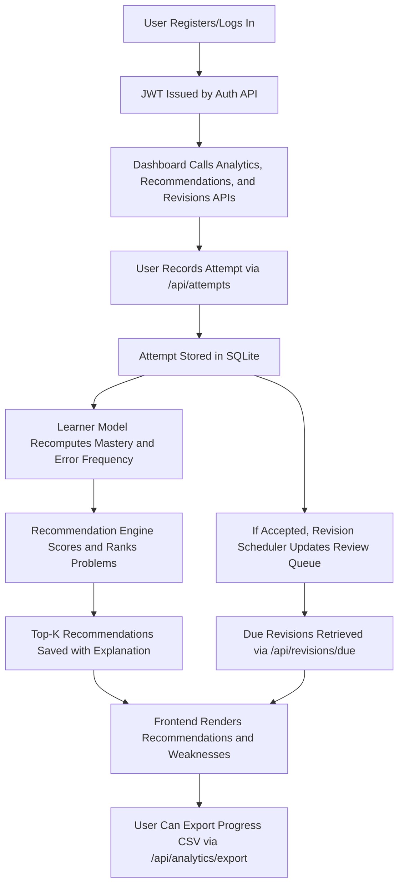

# Intelligent Learning Assistant for Coding based on ITS

**Study Project - AI/ML Course**  
**Student:** Anshu Sinha (2034EBCS191)  
**Advisor:** Vamsi Bandi  
**Based on:** Phase 1, Phase 2, and Phase 3 implementation

## 📋 Project Overview

An intelligent web-based tutoring system that personalizes coding interview preparation by:

- Analyzing learner practice history and error patterns
- Recommending optimal next problems to solve
- Tracking weaknesses in specific topics and patterns
- Scheduling spaced-repetition reviews
- Providing interpretable progress analytics

## 🆕 Phase 3 Upgrades

- Added environment-driven runtime configuration (`src/config.py`) for JWT settings, host/port, and CORS origins.
- Enforced admin authorization on `POST /api/problems`.
- Added analytics export endpoint `GET /api/analytics/export` (CSV download).
- Updated frontend API routing logic to support runtime override via `?api=http://localhost:PORT/api`.
- Updated documentation and validation notes for implementation readiness.

## 🏗️ System Architecture

```
Intelligent Learning Assistant for Coding based on ITS/
│
├── 📄 README.md                 # Complete documentation
├── 📄 QUICKSTART.md             # 5-minute setup guide
├── 📄 requirements.txt          # Python dependencies
│
├── 🔧 run.sh / run.bat          # Startup scripts
├── 🧪 test_installation.py     # Verify installation
├── 📊 load_sample_data.py       # Initialize database
│
├── 💻 src/                      # Backend source code
│   ├── main.py                  # FastAPI application (API + health routes)
│   ├── database.py              # SQLite schema (6 tables)
│   ├── models.py                # Pydantic models (10+ models)
│   ├── auth.py                  # JWT authentication
│   ├── config.py                # Environment-based runtime settings
│   ├── learner_model.py         # Learner analytics
│   ├── recommender.py           # Recommendation engine
│   └── revision_scheduler.py   # Spaced repetition
│
├── 🌐 frontend/                 # Web interface
│   └── index.html               # Dashboard UI
│
└── 💾 data/                     # Database (auto-created)
    └── coding_assistant.db
```

## 🔄 Workflow Pipeline



## 🚀 Quick Start


### Prerequisites

- Python 3.8 or higher (`python3`)
- pip (`python3 -m pip`)

### Installation

1. **Install dependencies:**

```bash
python3 -m pip install -r requirements.txt
```

2. **Initialize database with sample data:**

```bash
python3 load_sample_data.py
```

This creates:

- 30 sample coding problems
- Demo user account (email: `demo@example.com`, password: `demo123`)
- Sample practice history

3. **Start the backend server:**

```bash
python3 -m src.main
```

The API will be available at `http://localhost:8000` (default).  
If port 8000 is busy, run `PORT=8001 python3 -m src.main`.

4. **Open the frontend:**

Open `frontend/index.html` in your web browser, or serve it using:

```bash
# Using Python's built-in server
cd frontend
python3 -m http.server 8080
```

Then visit `http://localhost:8080`

If backend runs on a non-default port, open frontend with `?api=http://localhost:PORT/api` to override without editing code.

### Environment Configuration

Optional runtime variables:

- `SECRET_KEY` (default: `dev-secret-change-me`)
- `JWT_ALGORITHM` (default: `HS256`)
- `ACCESS_TOKEN_EXPIRE_MINUTES` (default: `1440`)
- `HOST` (default: `0.0.0.0`)
- `PORT` (default: `8000`)
- `CORS_ALLOW_ORIGINS` (comma-separated, defaults to local frontend origins)

Example:

```bash
SECRET_KEY="replace-this" PORT=8001 CORS_ALLOW_ORIGINS="http://localhost:8080" python3 -m src.main
```

## 🎯 Features Implemented

### ✅ Functional Requirements Status (Phase 3)

| Requirement                      | Status | Implementation                      |
| -------------------------------- | ------ | ----------------------------------- |
| FR1: User registration & login   | ✅     | JWT-based authentication            |
| FR2: User profile management     | ✅     | Target level, preferences           |
| FR3: Problem catalog             | ✅     | 30 sample problems, CRUD operations |
| FR4: Practice attempt recording  | ✅     | Verdict, time, error type tracking  |
| FR5: Weakness score computation  | ✅     | Topic/pattern mastery calculation   |
| FR6: Error pattern detection     | ✅     | Categorized error tracking          |
| FR7: Top-K recommendations       | ✅     | Hybrid scoring algorithm            |
| FR8: Recommendation explanations | ✅     | Human-readable reasons              |
| FR9: Spaced revision scheduling  | ✅     | 6-interval spaced repetition        |
| FR10: Progress dashboard         | ✅     | Stats, charts, weaknesses           |
| FR11: Recommendation feedback    | ✅     | Mark completed/not solved           |
| FR12: Real-time metric updates   | ✅     | Auto-update after attempts          |
| FR13: Admin problem management   | ⚠️     | Create endpoint is admin-protected in Phase 3; update flow pending |
| FR14: Progress export            | ✅     | CSV export endpoint (`GET /api/analytics/export`) |

## 🔑 API Endpoints

### Authentication

- `POST /api/auth/register` - Register new user
- `POST /api/auth/login` - Login and get JWT token
- `GET /api/auth/me` - Get current user profile

### Problems

- `POST /api/problems` - Create problem (admin)
- `GET /api/problems` - List problems with filters

### Practice

- `POST /api/attempts` - Record attempt
- `GET /api/attempts` - Get attempt history

### Recommendations

- `POST /api/recommendations/generate` - Generate top-K recommendations
- `GET /api/recommendations` - Get existing recommendations
- `POST /api/recommendations/{id}/complete` - Mark as completed

### Analytics

- `GET /api/analytics/dashboard` - Complete dashboard stats
- `GET /api/analytics/weaknesses` - Top weakness areas
- `GET /api/analytics/errors` - Error pattern summary
- `GET /api/analytics/export` - Download attempt history as CSV

### Revisions

- `GET /api/revisions/due` - Problems due for review
- `POST /api/revisions/{id}/complete` - Mark revision completed

## 🧠 Recommendation Algorithm

The system uses a **hybrid scoring approach**:

### Scoring Factors

1. **Topic Weakness (0-50 points)**
    - Higher score for topics with low mastery
    - Considers error frequency in topic

2. **Pattern Weakness (0-30 points)**
    - Targets specific algorithmic patterns
    - Two Pointers, Sliding Window, DFS, etc.

3. **Difficulty Progression (0-20 points)**
    - Matches user's target difficulty level
    - Supports adaptive progression

### Example Calculation

```python
Problem: "3Sum" (Medium, Array, Two Pointers)
User: Weak in Arrays (30% mastery), Target: Medium

Score = 35 (topic) + 20 (pattern) + 20 (difficulty) = 75
Reason: "Weak in Array (mastery: 30%) • Practice Two Pointers pattern"
```

## 📊 Learner Modeling

### Metrics Tracked

- **Mastery Score** = Success Rate per Topic/Pattern
- **Error Frequency** = Error Rate per Topic/Pattern
- **Attempt Count** = Total attempts per area
- **Success Rate** = Overall acceptance rate
- **Current Streak** = Consecutive successful days

### Error Categories

- `off-by-one` - Index boundary errors
- `edge-case` - Missed corner cases
- `timeout` - Time complexity issues
- `logic-error` - Algorithmic mistakes
- `memory-limit` - Space complexity issues

## 🔄 Spaced Repetition

Uses **6-interval schedule**:

- Day 1 (initial review)
- Day 3
- Day 7
- Day 14
- Day 30
- Day 60

Intervals double after completion, capped at 90 days.

## 🧪 Testing the System

### Test Scenario 1: New User Flow

1. Register account
2. Log solved problems
3. Generate recommendations
4. View weaknesses identified

### Test Scenario 2: Practice Recording

```bash
# Via API
curl -X POST http://localhost:8000/api/attempts \
  -H "Authorization: Bearer YOUR_TOKEN" \
  -H "Content-Type: application/json" \
  -d '{
    "problem_id": "two-sum",
    "verdict": "Accepted",
    "time_taken": 300
  }'
```

### Test Scenario 3: Recommendation Quality

1. Record struggles in Dynamic Programming
2. Generate recommendations
3. Verify DP problems are prioritized
4. Check explanation mentions weakness

## 📚 Sample Data

The system includes 30 LeetCode-style problems across:

- **Arrays** (Easy, Medium)
- **Strings** (Easy, Medium)
- **Linked Lists** (Easy)
- **Trees** (Easy, Medium)
- **Dynamic Programming** (Easy, Medium)
- **Graphs** (Medium)

Demo user has 16 practice attempts with:

- Mix of accepted/failed attempts
- Various error types
- Weakness in Dynamic Programming
- Moderate success in Arrays/Strings

## 🔒 Security

- **Password Hashing:** bcrypt with salt
- **Authentication:** JWT tokens (24h expiration)
- **Authorization:** Bearer token in headers
- **SQL Injection:** Parameterized queries
- **CORS:** Configured through `CORS_ALLOW_ORIGINS` environment variable

**Production TODO:**

- Enable HTTPS
- Add rate limiting
- Implement CSRF protection

## 🎓 Phase 3 Deliverables Checklist

- ✅ System architecture defined
- ✅ FR1-FR12 implemented, FR13 partially implemented, FR14 implemented
- ✅ Non-functional requirements addressed
- ✅ Database schema created
- ✅ Recommendation algorithm implemented
- ✅ Learner modeling module complete
- ✅ Spaced repetition scheduler working
- ✅ Web dashboard functional
- ✅ Authentication system secure
- ✅ API documentation provided

## 🚧 Future Enhancements (Post-Phase 3)

Based on the current implementation, next-step improvements:

- Integration with LeetCode/HackerRank APIs
- Advanced ML models (collaborative filtering)
- Real-time code analysis
- Peer comparison features
- Mobile app development
- PostgreSQL migration for scale
- Docker containerization
- CI/CD pipeline setup

## 📝 Academic Alignment

### Course Learning Outcomes Achieved

✅ Intelligent, adaptive system design  
✅ User modeling and personalization  
✅ Recommender system implementation  
✅ AI-driven learning support  
✅ Python development skills  
✅ System design and documentation

### ITS Components Implemented

- **Learner Model:** Tracks mastery, errors, progress
- **Domain Model:** Problem catalog with metadata
- **Tutoring Model:** Recommendation engine
- **Interface:** Web dashboard with analytics

## 👨‍💻 Development Notes

### Adding New Problems

```python
from src.database import Database
db = Database()
conn = db.get_connection()
cursor = conn.cursor()

cursor.execute("""
    INSERT INTO problems
    (problem_id, title, topic, pattern, difficulty, tags, description)
    VALUES (?, ?, ?, ?, ?, ?, ?)
""", ("new-problem", "Problem Title", "Array", "Two Pointers",
      "Medium", "array,pointers", "Description here"))

conn.commit()
conn.close()
```

### Manual Testing

```bash
# Check database
sqlite3 data/coding_assistant.db
> SELECT * FROM users;
> SELECT * FROM problems LIMIT 5;
> SELECT * FROM attempts WHERE user_id = 1;
```

## 📞 Contact

For questions or issues:

- **Student:** Anshu Sinha
- **Email:** anshujuly2@gmail.com
- **Advisor:** Vamsi Bandi

## 📄 License

MIT License

---

**Last Updated:** February 26, 2026
**Version:** 1.1.0 (Phase 3 Implementation)
